# 🚀 Production Deployment Runbook

**Verze**: 2.0  
**Datum**: 5. ledna 2026  
**Status**: ✅ Production Ready  
**Čas nasazení**: ~5-6 hodin (bez pilotáže)

---

## 📋 Přehled Nasazovacího Procesu

```mermaid
graph LR
    A["Příprava<br/>60 min"] -->|Git, Build| B["Migrace DB<br/>30 min"]
    B -->|Backup| C["Testy<br/>45 min"]
    C -->|All Pass| D["Security Audit<br/>60 min"]
    D -->|No Issues| E["Cron Setup<br/>30 min"]
    E -->|Enabled| F["Web Server<br/>45 min"]
    F -->|Gunicorn+Nginx| G["Monitoring<br/>30 min"]
    G -->|Sentry+Logs| H["Production Go<br/>✅"]
    
    style A fill:#e1f5ff
    style B fill:#e1f5ff
    style C fill:#fff9c4
    style D fill:#fff9c4
    style E fill:#f3e5f5
    style F fill:#f3e5f5
    style G fill:#e8f5e9
    style H fill:#c8e6c9
```



---

## 🔄 Fáze 1: Příprava & Build (60 minut)

### 1.1 Git Commit & Push
```bash
cd /home/lenkaluksova/hypoteky_win

# Zkontroluj stav
git status
git log --oneline | head -5

# Commit všech změn
git add .
git commit -m "Pre-production deployment - $(date +%Y%m%d)"

# Ověř, že jsi na main
git branch
git push origin main

# Vytvoř deployment tag
git tag v1.0.0-prod
git push origin v1.0.0-prod
```

**Ověření**:
- ✅ `git status` vrací "nothing to commit"
- ✅ `git log` ukazuje poslední commit
- ✅ GitHub Actions CI pipeline je zelená (projít v WebUI)

---

### 1.2 Virtuální Prostředí & Závislosti
```bash
source /home/lenkaluksova/hypoteky_win/.venv/bin/activate

# Upgrade pip/setuptools
pip install --upgrade pip setuptools wheel

# Reinstall requirements
pip install -r /home/lenkaluksova/hypoteky_win/requirements.txt

# Ověř kritické balíčky
pip show django
pip show django-encrypted-model-fields
pip show djangorestframework
pip show gunicorn  # Pro web server
```

**Očekávání**:
- ✅ `Django: 4.2.27` (LTS)
- ✅ `djangorestframework: 3.14+`
- ✅ `django-encrypted-model-fields: latest`
- ✅ `gunicorn: 21.0+`

---

### 1.3 Environment Config Check
```bash
# Zkontroluj .env pro ALL povinné klíče
cat /home/lenkaluksova/hypoteky_win/.env | grep -E "^[A-Z_]+=" | sort

# Ověř kritické klíče (copypaste níže):
grep "^SECRET_KEY=" /home/lenkaluksova/hypoteky_win/.env          # ✅ musí být
grep "^DEBUG=" /home/lenkaluksova/hypoteky_win/.env              # ✅ musí být False
grep "^ALLOWED_HOSTS=" /home/lenkaluksova/hypoteky_win/.env      # ✅ musí mít domény
grep "^DB_ENGINE=" /home/lenkaluksova/hypoteky_win/.env          # ✅ mysql
grep "^DB_NAME=" /home/lenkaluksova/hypoteky_win/.env            # ✅ produkční DB
grep "^DB_USER=" /home/lenkaluksova/hypoteky_win/.env            # ✅ DB user
grep "^DB_PASSWORD=" /home/lenkaluksova/hypoteky_win/.env        # ✅ DB password
grep "^DB_HOST=" /home/lenkaluksova/hypoteky_win/.env            # ✅ DB host
grep "^ENCRYPTED_MODEL_FIELDS_KEY=" /home/lenkaluksova/hypoteky_win/.env  # ✅ Fernet key
grep "^EMAIL_" /home/lenkaluksova/hypoteky_win/.env              # ✅ SMTP config
```

**Pokud něco chybí**:
```bash
# Generuj nový SECRET_KEY
python -c "from django.core.management.utils import get_random_secret_key; print(get_random_secret_key())"

# Generuj ENCRYPTED_MODEL_FIELDS_KEY
python -c "from cryptography.fernet import Fernet; print(Fernet.generate_key().decode())"

# Přidej do .env
echo "SECRET_KEY=<generated_key>" >> /home/lenkaluksova/hypoteky_win/.env
echo "ENCRYPTED_MODEL_FIELDS_KEY=<generated_key>" >> /home/lenkaluksova/hypoteky_win/.env
```

---

### 1.4 Frontend Build (pokud máš JS/React)
```bash
# Zkontroluj, zda existuje package.json
ls -la /home/lenkaluksova/hypoteky_win/package.json 2>/dev/null || echo "Není npm projekt"

# Pokud existuje:
cd /home/lenkaluksova/hypoteky_win
npm install
npm run build
ls -la dist/ || ls -la build/
```

---

### 1.5 Django Static Files Collect
```bash
cd /home/lenkaluksova/hypoteky_win
source .venv/bin/activate

# Sberi statické soubory
python manage.py collectstatic --noinput --clear

# Ověř
ls -la static/
du -sh static/  # Mělo by být 50MB+
find static/ -name "*.css" -o -name "*.js" | wc -l  # Mělo by být 100+
```

**Očekávání**:
- ✅ `static/` obsahuje CSS, JS, FontAwesome
- ✅ Žádná chyba (red) v outputu

---

## 🗄️ Fáze 2: Databáze & Migrace (30 minut)

### 2.1 DB Backup (CRITICAL - Udělej PŘED migrací!)
```bash
# Pro MySQL
BACKUP_FILE="/home/lenkaluksova/backups/hypoteky_$(date +%Y%m%d_%H%M%S).sql"
mkdir -p /home/lenkaluksova/backups

mysqldump \
  -u hypoteky_user \
  -p \
  --default-character-set=utf8mb4 \
  hypoteky_prod \
  > "$BACKUP_FILE"

# Ověř backup
ls -lh "$BACKUP_FILE"
du -sh "$BACKUP_FILE"

# Ulož na bezpečném místě (Google Drive, AWS S3, atd.)
echo "Backup vytvořen: $BACKUP_FILE"
```

**Pro SQLite** (dev):
```bash
cp /home/lenkaluksova/hypoteky_win/db.sqlite3 /home/lenkaluksova/backups/db_$(date +%Y%m%d_%H%M%S).sqlite3
```

---

### 2.2 Migrace Plán
```bash
cd /home/lenkaluksova/hypoteky_win
source .venv/bin/activate

# Zkontroluj co se má migrovat
python manage.py migrate --plan

# Očekávaní output:
# ...
# klienti.0020_update_workflow_choices
# ... (žádné chyby)
```

---

### 2.3 Spustit Migrace
```bash
cd /home/lenkaluksova/hypoteky_win
source .venv/bin/activate

python manage.py migrate

# Mělo by vrátit:
# Operations to perform:
#   Apply all migrations: ...
# Running migrations:
#   Applying klienti.0020_update_workflow_choices... OK
```

**Pokud chyba**:
```bash
# Rollback z backupu
mysql -u hypoteky_user -p hypoteky_prod < /home/lenkaluksova/backups/hypoteky_YYYYMMDD_HHMMSS.sql
```

---

### 2.4 Data Validace
```bash
python manage.py shell

# V Django shell:
from klienti.models import Klient, HypotekaWorkflow

# Ověř workflow choices
print("Workflow choices (mělo by být 15):")
print(dict(HypotekaWorkflow.KROK_CHOICES))

# Ověř max step v datech
max_step = Klient.objects.order_by('-aktualni_krok').first()
if max_step:
    print(f"Max krok v datech: {max_step.aktualni_krok}")
    if max_step.aktualni_krok > 15:
        print("⚠️ VAROVÁNÍ: Data obsahují step > 15!")

# Počet klientů
print(f"Celkem klientů: {Klient.objects.count()}")

exit()
```

---

## ✅ Fáze 3: Testování (45 minut)

### 3.1 Unit Testy (Core Logic)
```bash
cd /home/lenkaluksova/hypoteky_win
source .venv/bin/activate

# Spusť core testy
pytest klienti/tests_views.py klienti/tests_api.py klienti/tests_bezpecnost.py -v

# Očekávání: ✅ 42 passed, 0 failed
```

---

### 3.2 Model & Integration Testy
```bash
pytest klienti/tests_models.py -v
pytest klienti/tests_notif*.py -v 2>/dev/null || echo "Some test files may not exist"

# Očekávání: ✅ Všechny prochází
```

---

### 3.3 Full Test Suite s Coverage
```bash
DJANGO_SETTINGS_MODULE=hypoteky.settings_test pytest \
  --cov=klienti \
  --cov-report=term-missing \
  --cov-report=html

# Očekávání:
# ✅ TOTAL: 85%+ coverage
# ✅ No FAILED tests

# Otevři report
open htmlcov/index.html  # nebo: firefox htmlcov/index.html
```

---

### 3.4 E2E Testy (s live serverem)
```bash
# Terminal 1: Spusť server
cd /home/lenkaluksova/hypoteky_win
source .venv/bin/activate
python manage.py runserver 0.0.0.0:8000

# Terminal 2: E2E testy
cd /home/lenkaluksova/hypoteky_win
source .venv/bin/activate
pytest dev/tests_e2e_playwright.py -v

# Očekávání: ✅ Všechny E2E testy procházejí
# (Pokud selhávají, zkontroluj server + browser)
```

---

## 🔒 Fáze 4: Bezpečnostní Audit (60 minut)

### 4.1 Django Security Check
```bash
cd /home/lenkaluksova/hypoteky_win
source .venv/bin/activate

python manage.py check --deploy

# Očekávání: "System check identified no issues."
```

---

### 4.2 Requirements Security
```bash
bash /home/lenkaluksova/hypoteky_win/dev/check_requirements_security.sh

# Pokud něco je riziková verze:
pip install -U <package_name>
pip freeze > /home/lenkaluksova/hypoteky_win/requirements.txt
```

---

### 4.3 Encrypted Fields Check
```bash
python manage.py shell

from klienti.models import Klient
import inspect

# Ověř, že jsou pole šifrována
source = inspect.getsource(Klient)
encrypted_count = source.count("EncryptedCharField") + source.count("EncryptedTextField")
print(f"Šifrovaných polí: {encrypted_count}")
# Mělo by být: 14

exit()
```

---

### 4.4 Audit Logs Check
```bash
python manage.py shell

from klienti.models import Zmena
print(f"Auditních logů: {Zmena.objects.count()}")

# Zobraz poslední log
last_zmena = Zmena.objects.order_by('-cas_zmeny').first()
if last_zmena:
    print(f"Poslední log: {last_zmena}")
    print(f"Změny popis je zašifrován: {len(last_zmena.zmeny_popis) > 20}")

exit()
```

---

### 4.5 GDPR Compliance
```bash
# Ověř, že existují endpoints
curl http://localhost:8000/klienti/1/export/    # Mělo by vrátit export
curl http://localhost:8000/klienti/1/delete/    # Mělo by vrátit delete form

# Ověř Django shell
python manage.py shell
from django.contrib.auth.models import User
from klienti.models import Klient

# Vytvoř test data
user = User.objects.create(username="gdpr_test_user")
klient = Klient.objects.create(jmeno="GDPR Test", vlastnik=user)
print(f"Vytvořen klient: {klient.id}")

# Smaž
klient.delete()
try:
    Klient.objects.get(id=klient.id)
    print("❌ CHYBA: Klient nebyl smazán!")
except Klient.DoesNotExist:
    print("✅ Klient byl správně smazán")

# Cleanup
user.delete()
exit()
```

---

## 📧 Fáze 5: Notifikace & Cron (30 minut)

### 5.1 Email Test
```bash
python manage.py shell

from django.core.mail import send_mail

try:
    send_mail(
        subject='Produkční Test Email',
        message='Pokud vidíš tuto zprávu, email funguje! ✅',
        from_email='app@example.com',
        recipient_list=['your_email@example.com'],
        fail_silently=False
    )
    print("✅ Email byl odeslán")
except Exception as e:
    print(f"❌ Chyba: {e}")

exit()

# Zkontroluj inbox (může trvat 1-2 minuty)
```

---

### 5.2 Management Commands Test
```bash
python manage.py send_deadline_notifications
# Mělo by vrátit: "Notifikace odeslány pro N klientů"

python manage.py send_reporting_email
# Mělo by vrátit: "Report odeslán"

# Ověř, že se zaznamenaly v NotifikaceLog
python manage.py shell
from klienti.models import NotifikaceLog
print(f"Notifikací celkem: {NotifikaceLog.objects.count()}")
print(f"Poslední notifikace: {NotifikaceLog.objects.latest('vytvorena_at')}")
exit()
```

---

### 5.3 Nasadit Cron/Systemd
```bash
# Zkontroluj skript
cat /home/lenkaluksova/hypoteky_win/dev/setup_cron_notifications.sh | head -50

# Náhled nastavení
bash /home/lenkaluksova/hypoteky_win/dev/setup_cron_notifications.sh --show

# Instaluj cron (jednodušší)
sudo bash /home/lenkaluksova/hypoteky_win/dev/setup_cron_notifications.sh --cron

# Ověř
sudo crontab -l | grep hypoteky

# Alternativa: Systemd timers
sudo bash /home/lenkaluksova/hypoteky_win/dev/setup_cron_notifications.sh --systemd
sudo systemctl enable hypoteky-notifications.timer
sudo systemctl start hypoteky-notifications.timer
sudo systemctl status hypoteky-notifications.timer
```

---

## 🌐 Fáze 6: Web Server Setup (45 minut)

### 6.1 Gunicorn Installation & Test
```bash
source /home/lenkaluksova/hypoteky_win/.venv/bin/activate

pip install gunicorn
gunicorn --version

# Test Gunicorn
cd /home/lenkaluksova/hypoteky_win
gunicorn \
  --workers 4 \
  --worker-class sync \
  --bind 0.0.0.0:8001 \
  --timeout 30 \
  hypoteky.wsgi:application

# V jiném terminálu: Test
curl http://localhost:8001/
# Mělo by vrátit HTML (login page)

# Ctrl+C pro zastavení
```

---

### 6.2 Systemd Service pro Gunicorn
```bash
# Vytvoř /etc/systemd/system/hypoteky.service
sudo nano /etc/systemd/system/hypoteky.service

# Vlož:
```
[Unit]
Description=Hypotéky Gunicorn Application
After=network.target mysql.service

[Service]
User=www-data
Group=www-data
WorkingDirectory=/home/lenkaluksova/hypoteky_win
Environment="PATH=/home/lenkaluksova/hypoteky_win/.venv/bin"
ExecStart=/home/lenkaluksova/hypoteky_win/.venv/bin/gunicorn \
    --workers 4 \
    --worker-class sync \
    --bind unix:/run/gunicorn.sock \
    --timeout 30 \
    --access-logfile /var/log/hypoteky/gunicorn_access.log \
    --error-logfile /var/log/hypoteky/gunicorn_error.log \
    hypoteky.wsgi:application
Restart=always
RestartSec=10

[Install]
WantedBy=multi-user.target
```
# Ctrl+O, Enter, Ctrl+X

# Spusť service
sudo mkdir -p /var/log/hypoteky
sudo chown www-data:www-data /var/log/hypoteky
sudo systemctl daemon-reload
sudo systemctl enable hypoteky
sudo systemctl start hypoteky
sudo systemctl status hypoteky

# Ověř socket
ls -la /run/gunicorn.sock
```

---

### 6.3 Nginx Reverse Proxy
```bash
# Vytvoř /etc/nginx/sites-available/hypoteky.conf
sudo nano /etc/nginx/sites-available/hypoteky.conf

# Vlož:
```
# HTTP -> HTTPS redirect
server {
    listen 80;
    server_name example.com www.example.com;
    return 301 https://$server_name$request_uri;
}

# HTTPS server
server {
    listen 443 ssl http2;
    server_name example.com www.example.com;

    # SSL certificates (Let's Encrypt)
    ssl_certificate /etc/letsencrypt/live/example.com/fullchain.pem;
    ssl_certificate_key /etc/letsencrypt/live/example.com/privkey.pem;
    ssl_protocols TLSv1.2 TLSv1.3;
    ssl_ciphers HIGH:!aNULL:!MD5;
    ssl_prefer_server_ciphers on;
    ssl_session_cache shared:SSL:10m;
    ssl_session_timeout 10m;

    # Logging
    access_log /var/log/nginx/hypoteky_access.log;
    error_log /var/log/nginx/hypoteky_error.log warn;

    # Client upload limit
    client_max_body_size 100M;

    # Security headers
    add_header Strict-Transport-Security "max-age=31536000; includeSubDomains" always;
    add_header X-Content-Type-Options "nosniff" always;
    add_header X-Frame-Options "DENY" always;
    add_header X-XSS-Protection "1; mode=block" always;

    # Proxy to Gunicorn
    location / {
        proxy_pass http://unix:/run/gunicorn.sock;
        proxy_set_header Host $host;
        proxy_set_header X-Real-IP $remote_addr;
        proxy_set_header X-Forwarded-For $proxy_add_x_forwarded_for;
        proxy_set_header X-Forwarded-Proto $scheme;
        proxy_redirect off;
        proxy_connect_timeout 60s;
        proxy_send_timeout 60s;
        proxy_read_timeout 60s;
    }

    # Static files (CSS, JS, images)
    location /static/ {
        alias /home/lenkaluksova/hypoteky_win/static/;
        expires 30d;
        add_header Cache-Control "public, immutable";
    }

    # Media (uploads)
    location /media/ {
        alias /home/lenkaluksova/hypoteky_win/media/;
        expires 7d;
    }
}
```
# Ctrl+O, Enter, Ctrl+X

# Enable site
sudo ln -s /etc/nginx/sites-available/hypoteky.conf /etc/nginx/sites-enabled/

# Test config
sudo nginx -t
# Mělo by vrátit: "test successful"

# Reload Nginx
sudo systemctl reload nginx

# Ověř
curl https://example.com/
```

---

### 6.4 SSL Certificate (Let's Encrypt)
```bash
# Instaluj Certbot
sudo apt-get update
sudo apt-get install certbot python3-certbot-nginx

# Vygeneruj certifikát
sudo certbot certonly --nginx -d example.com -d www.example.com

# Ověř
sudo certbot certificates

# Auto-renew
sudo systemctl enable certbot.timer
sudo systemctl start certbot.timer
sudo systemctl status certbot.timer
```

---

## 📊 Fáze 7: Monitoring & Logging (30 minut)

### 7.1 Log Files Check
```bash
# Django logs
tail -50 /var/log/hypoteky/django.log
tail -50 /var/log/hypoteky/gunicorn_error.log

# Nginx logs
tail -50 /var/log/nginx/hypoteky_error.log

# Cron/Notification logs
tail -50 /var/log/hypoteky_notifications.log
tail -50 /var/log/hypoteky_reporting.log

# System logs
sudo journalctl -u hypoteky --no-pager -n 50
sudo journalctl -u nginx --no-pager -n 50
```

---

### 7.2 Health Checks
```bash
# Website accessibility
curl -I https://example.com/
# Mělo by vrátit: HTTP/2 200

# Admin page
curl -s https://example.com/admin/ | head -20

# API health
curl https://example.com/api/klienti/ -H "Authorization: Bearer YOUR_JWT_TOKEN"
# Mělo by vrátit: JSON s klienty

# Database connection
python manage.py shell -c "from django.db import connection; connection.ensure_connection(); print('✅ DB OK')"

# Gunicorn status
systemctl status hypoteky
ps aux | grep gunicorn

# Nginx status
systemctl status nginx
ps aux | grep nginx
```

---

### 7.3 Sentry Setup (Optional - Error Monitoring)
```bash
# Registruj na https://sentry.io (free tier)
# 1. Create project
# 2. Get SENTRY_DSN from settings

# Přidej do .env
echo "SENTRY_DSN=https://xxxxx@sentry.io/xxxxx" >> /home/lenkaluksova/hypoteky_win/.env

# Přidej do settings.py
nano /home/lenkaluksova/hypoteky_win/hypoteky/settings.py

# Přidej na konec:
import sentry_sdk
if not DEBUG:
    sentry_sdk.init(
        dsn=os.environ.get("SENTRY_DSN", ""),
        traces_sample_rate=0.1,
        environment="production"
    )

# Restartuj Gunicorn
sudo systemctl restart hypoteky

# Test error tracking
python manage.py shell -c "1/0"  # Trigger error (mělo by se zaznamenat v Sentryji)
```

---

## 📝 Fáze 8: Final Verification (30 minut)

### 8.1 Checklist
```bash
# ✅ Git & Code
git status  # nothing to commit
git branch  # main
git log --oneline | head -1

# ✅ Database
python manage.py showmigrations klienti | grep "\[X\]"  # Všechny migrace by měly mít [X]
python manage.py shell -c "from klienti.models import Klient; print(f'Klientů: {Klient.objects.count()}')"

# ✅ Tests
pytest klienti/tests_views.py -q  # Mělo by být: passed

# ✅ Static Files
du -sh /home/lenkaluksova/hypoteky_win/static/  # Mělo by být 50MB+

# ✅ Services
systemctl status hypoteky    # active (running)
systemctl status nginx       # active (running)
sudo crontab -l             # hypoteky cron entries viditelné

# ✅ Website
curl -I https://example.com/          # HTTP/2 200
curl -I https://example.com/admin/    # HTTP/2 200 nebo 302 (redirect)

# ✅ Emails
python manage.py send_deadline_notifications

# ✅ Security
python manage.py check --deploy       # no issues

# ✅ Logs
tail -5 /var/log/hypoteky/django.log  # žádné ERROR
```

---

### 8.2 User Acceptance Testing
```bash
# Základní workflow:
1. Navštiv https://example.com
2. Zaměř se na login page
3. Klikni "Admin"
4. Login s admin credentials
5. Vytvoř nového klienta
6. Edituj klienta (změní se auditní log)
7. Smaž klienta
8. Zkontroluj reporting

# Ověř notifikace:
- Zkontroluj email (měl by dorazit deadline notification či report)
- Zkontroluj database (NotifikaceLog by měl mít nové záznamy)
```

---

## 🔄 Rollback Plan

Pokud se něco pokazí:

### Rollback - Kód
```bash
# Vrátit na předchozí verzi
cd /home/lenkaluksova/hypoteky_win
git log --oneline | head -10
git revert HEAD  # nebo: git reset --hard <commit>
git push origin main

# Restartuj aplikaci
sudo systemctl restart hypoteky
```

### Rollback - Databáze
```bash
# Zastavit aplikaci
sudo systemctl stop hypoteky

# Obnovit z backupu
mysql -u hypoteky_user -p hypoteky_prod < /home/lenkaluksova/backups/hypoteky_<DATETIME>.sql

# Spustit migrace (pokud potřeba)
cd /home/lenkaluksova/hypoteky_win
source .venv/bin/activate
python manage.py migrate

# Spustit aplikaci
sudo systemctl start hypoteky
```

---

## 📞 Escalation Contacts

| Role | Name | Email | Phone |
|------|------|-------|-------|
| DevOps Lead | - | ops@company.com | +420 xxx xxx xxx |
| Developer | - | dev@company.com | +420 xxx xxx xxx |
| QA/Tester | - | qa@company.com | +420 xxx xxx xxx |
| Security | - | security@company.com | +420 xxx xxx xxx |

---

## 📋 Sign-off

```
Date: _______________

DevOps Approval:     _________________ (jméno)
Developer Approval:  _________________ (jméno)
QA Approval:         _________________ (jméno)
Security Approval:   _________________ (jméno)

Go/No-Go Decision:   ☐ GO    ☐ NO-GO

Notes:
_________________________________________________________________
_________________________________________________________________
```

---

**Last updated**: 5. ledna 2026  
**Version**: 2.0 - Production Ready  
**Created by**: Copilot AI Assistant
